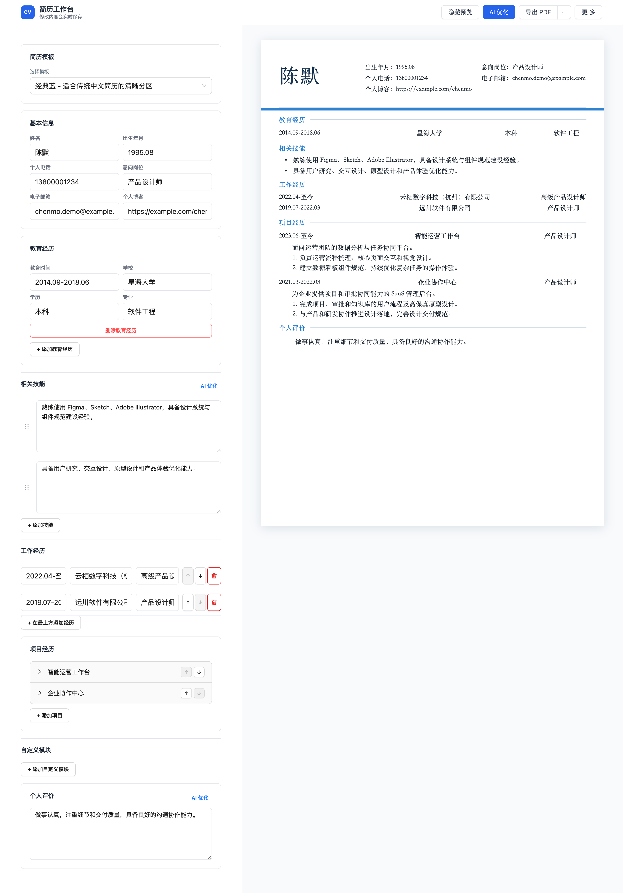

# 简历工作台

一个本地优先的 React 简历编辑器，支持多份简历、模板预览、Markdown/PDF 导入导出与基于 LLM 的简历表达优化。PDF 使用浏览器原生打印生成，保证文字可复制、版式清晰。



## 运行

需安装 Node `20.19+` 或 `22.12+` 及 pnpm：

```bash
pnpm install
pnpm dev
```

`pnpm dev` 会同时启动：

- 前端：Vite 开发服务器
- 后端：`http://localhost:3001` Fastify LLM 代理

也可分别运行：

```bash
pnpm dev:front
pnpm dev:backend
```

## 功能

- 自动保存到浏览器本地存储，支持新建、切换、重命名和删除多份简历。
- 编辑基本信息、教育经历、技能、工作经历、项目经历、个人评价及任意自定义模块。
- 技能与项目职责支持拖拽调整顺序；项目经历支持上下移动排序。
- 提供经典蓝、简约灰、编辑暖调、技术深色四套简历模板。
- 支持 Markdown 与可复制文本 PDF 导入，导出 Markdown 和浏览器打印 PDF。
- 导出前执行简历完整性检查。
- 支持整份简历、技能、个人评价和项目描述的 AI 优化；结果以“优化前 / 优化后”对比确认，只有用户确认后才应用。

## LLM 配置

在“更多 - LLM 配置”中填写接口地址、API Key 和模型名称。配置只保存在当前浏览器会话，并由本地后端在每次优化时使用。

后端使用 OpenAI Chat Completions 兼容格式，接口地址可填写服务根地址或完整的 `/chat/completions` 地址，例如：

```text
https://api.openai.com/v1
```

不要将 API Key 提交到 Git。若使用非本地启动方式，请在后端环境中确认可以访问对应 LLM 服务。

## 验证

```bash
pnpm build
pnpm --filter resume-editor-backend check
```

## 主要文件

- `front/`：Vite + React 前端
- `backend/`：Fastify LLM 代理服务
- `front/src/data/`：默认简历、缓存兼容与多简历工作区
- `front/src/components/`：编辑字段、编辑器、简历预览与列表管理
- `front/src/features/`：AI、Markdown/PDF 导入导出与检查能力
